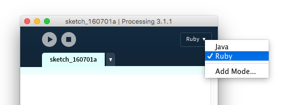

Ruby Mode for PDE (Processing)
==============================

**Worki in progress**

This is additional mode for PDE, [Processing](http://www.processing.org/) IDE.
You can write graphical application in Ruby.

Code to run application is taken from [ruby-processing](https://github.com/jashkenas/ruby-processing).

# Development
## Requirements
  * Java tools: `javac`, `jar`
  * Processing runtime jars: `core.jar`, `pde.jar`

## How to build
  * Type `make` at the repository root directory.
  * `dist/RubyMode/RubyMode.jar` will be created

## How to install
  + Create `RubyMode` directory in `modes` directory in Processing work directory:
    * MacOSX: `~/Documents/Processing/modes/`
    * Windows: `%homepath%\Documents\modes\`
    * Linux: `~/sketchbook/modes/`
    + Copy all files under `dist/RubyMode/` directory into created `RubyMode` directory
  + Copy all files under `dist/RubyMode/` into Processing `RubyMode` directory.
  + Reboot Processing

## How to use Ruby mode in PDE
  * Choose `Ruby` from mode pull down menu in PDE

# Info
  * JRuby: jruby-complete-9.1.2.jar
